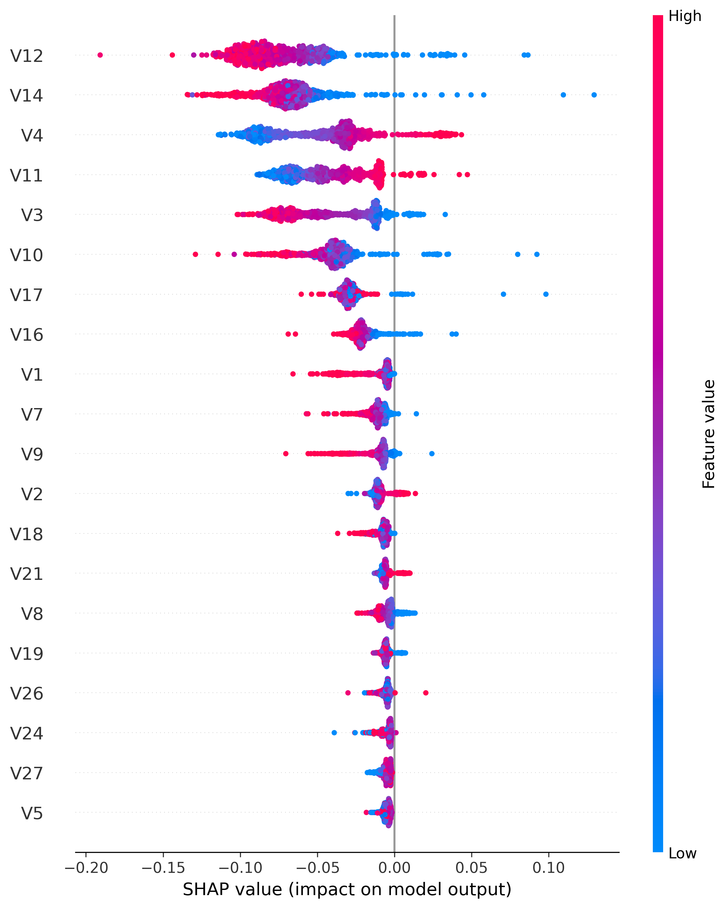

# 💳 Fraud Detection System


## 🚀 Overview

This project builds a Machine Learning system capable of detecting fraudulent credit card transactions.

The goal is to identify fraud accurately while minimizing false positives, a critical requirement in modern financial systems.

The project covers the complete machine learning workflow:

- Data Exploration (EDA)
- Data Preprocessing
- Logistic Regression Baseline
- Random Forest Modeling
- Cross Validation
- Model Persistence
- Fraud Probability Scoring
- Explainable AI with SHAP

---

## 📊 Dataset

**Credit Card Fraud Detection Dataset**
The dataset used for this project is the Credit Card Fraud Detection Dataset.

Due to file size limitations, the dataset is not included in this repository.

You can download it from:

https://www.kaggle.com/datasets/mlg-ulb/creditcardfraud

After downloading, place the file here:

data/raw/creditcard.csv

Dataset Statistics:

| Metric | Value |
|----------|----------|
| Total Transactions | 284,807 |
| Fraudulent Transactions | 492 |
| Normal Transactions | 284,315 |
| Features | 30 |
| Target Variable | Class |

### Feature Description

The dataset contains anonymized features:

- V1 – V28 (PCA-transformed features)
- Time
- Amount

To protect customer privacy, the original banking attributes were transformed using Principal Component Analysis (PCA).

---

## 🛠 Technologies Used

- Python
- Pandas
- NumPy
- Scikit-Learn
- Matplotlib
- SHAP
- Joblib
- Jupyter Notebook

---

# 🤖 Models Implemented

## 1. Logistic Regression

Used as a baseline classifier.

Advantages:

- Fast training
- Easy interpretation
- Strong baseline performance

---

## 2. Random Forest Classifier

Used to capture non-linear relationships within transaction data.

Advantages:

- Handles complex fraud patterns
- Robust to noise
- Strong predictive performance
- Provides feature importance scores

---

# 📈 Model Results

## Random Forest Performance

### Classification Report

| Metric | Fraud Class |
|----------|----------|
| Precision | 0.99 |
| Recall | 0.76 |
| F1-Score | 0.86 |

### Confusion Matrix

```text
[[56863     1]
 [   24    74]]
```

### Key Findings

✅ Extremely low false positive rate

✅ High fraud detection capability

✅ Strong balance between precision and recall

✅ Outperformed the baseline Logistic Regression model

---

# 🔍 Feature Importance

The Random Forest model identified the following features as the most influential:

| Feature | Importance |
|----------|----------|
| V14 | 0.1848 |
| V10 | 0.1120 |
| V12 | 0.1091 |
| V17 | 0.0924 |
| V4 | 0.0908 |
| V3 | 0.0577 |
| V11 | 0.0543 |

These features contributed most strongly to fraud detection decisions.

---

# 📊 SHAP Visualization

SHAP (SHapley Additive exPlanations) was used to understand why the model makes specific predictions.

Two levels of explainability were explored:

## Global Explainability

Understanding which features influence fraud predictions across the entire dataset.

Top SHAP Features:

- V14
- V12
- V10
- V17
- V11

## SHAP Summary Plot



---

## Local Explainability

Explaining individual fraud predictions.

Example:

A fraudulent transaction was predicted with:

```text
Fraud Risk Score = 86%
```

SHAP revealed that features such as:

- V14
- V10
- V12

contributed most strongly toward the fraud prediction.

---

# 🧠 Cross Validation

Cross-validation was performed to evaluate model stability.

Scores:

```text
[0.7383, 0.8814, 0.7263, 0.8024, 0.7105]
```

Average Score:

```text
0.7718
```

Standard Deviation:

```text
0.0631
```

### Interpretation

The relatively low standard deviation indicates that the model performs consistently across different data splits.

---

# 📂 Project Structure

```text
fraud-detection-system/

├── data/
│   └── raw/
│       └── creditcard.csv
│
├── models/
│   └── fraud_random_forest.pkl
│
├── notebooks/
│   └── eda.ipynb
│
├── src/
│   ├── ingestion/
│   │   └── load_data.py
│   │
│   ├── models/
│   │   ├── train_model.py
│   │   ├── random_forest.py
│   │   ├── predict.py
│   │   ├── cross_validation.py
│   │   └── shap_explain.py
│   │
│   └── utils/
│       └── predictor.py
│
├── test_predictor.py
├── requirements.txt
└── README.md
```

---

# ⚙️ Installation

Clone the repository:

```bash
https://github.com/ArinolaDev/fraud-detection-system.git
```

Move into the project:

```bash
cd fraud-detection-system
```

Install dependencies:

```bash
pip install -r requirements.txt
```

---

# ▶️ Usage

Train the model:

```bash
python src/models/random_forest.py
```

Run predictions:

```bash
python test_predictor.py
```

---

# 🎯 Learning Outcomes

Through this project I gained practical experience in:

- Machine Learning Classification
- Fraud Detection Systems
- Model Evaluation
- Cross Validation
- Explainable AI (SHAP)
- Feature Importance Analysis
- Model Persistence
- Production-Oriented Project Structure

---

# 👨‍💻 Author

**Arinola Smart**

Machine Learning & AI Enthusiast

Building projects in:
- Machine Learning
- Deep Learning
- Large Language Models
- AI Engineering
